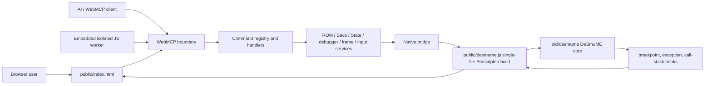

# desmume_webassembly

DeSmuME WebAssembly debugger with a local-only browser UI and WebMCP-style AI control surface.

Public deployment: https://daisukedaisuke.github.io/desmume_webassembly/

## What This Provides

| Area | Supported |
|---|---|
| ROM handling | Local `.nds` upload in the browser filesystem; no ROM upload to a server |
| Save handling | `.sav`/`.dsv` import/export, browser save slots, recent save reload |
| State handling | `.dst` import/export, IndexedDB-backed state slots up to the browser storage limit, recent state reload |
| Runtime control | Pause, resume, reset, N-frame stepping, 0.25x to 4x speed, render on/off, audio on/off and volume |
| Display/input | 1x to 4x scale, 0/90/180/270 rotation, pointer touch on the lower DS screen, configurable hotkeys |
| Debugger | ARM9/ARM7 registers, changed-register highlight, PC disassembly, step, step over, continue |
| Breakpoints | Execution, memory read, memory write, data abort, prefetch abort, undefined instruction; a hit always pauses emulation |
| Memory tools | Hex dump, GUI auto-update, click-to-edit bytes, u8/u16/u32 writes, file-to-memory injection, freeze values, search/refine |
| Call stack | registerenterfunc-style call stack collection, scrollable GUI table, disassembly jump buttons |
| Automation | `window.DesmumeMCP.call()`, `postMessage`, and isolated JS injection using the same command API |

## Architecture



## Build

Application source lives under `src/`. `public/app.js` is a generated IIFE bundle and must not be edited directly. Worker source also lives under `src/workers/`; the JavaScript build embeds it as text in `public/app.js`, so production does not request separate first-party Worker files. `public/coi-serviceworker.js` remains an independent vendored asset and is neither bundled nor generically minified.

Install the pinned JavaScript build dependencies and run the checks:

```bash
npm ci
npm test
npm run check:licenses
npm run check:js
npm run build:js
npm run build:notices
```

`npm run build:js` creates the minified production `public/app.js` without a source map. For local development, run:

```bash
npm run watch:js
```

The watch build writes the same `public/app.js` path with an inline source map and continues watching `src/**/*.js`. Stop it with `Ctrl+C`. Before copying or deploying an artifact after using the watcher, rerun `npm run build:js` to restore the minified production bundle.

Serve `public/` through the existing local server so local and Pages use the same asset paths:

```powershell
C:\Users\owner\CLionProjects\deweb\start-test-server.ps1
```

Then open `http://localhost:8766/`. Do not open `public/index.html` directly as a `file:` URL.

The native Emscripten build is run in a Codespace. Check the current Codespace name first, transfer locally edited source with `gh codespace cp -e`, and build from the repository root:

```bash
gh codespace list
gh codespace ssh -c <codespace-name> "cd /workspaces/desmume_webassembly && bash webassembly/build.sh"
```

For C++, WASM export, native bridge, breakpoint, or frame-counter changes, also run the diagnostic build used for browser regression:

```bash
gh codespace ssh -c <codespace-name> "cd /workspaces/desmume_webassembly && bash webassembly/build_safe_heap.sh"
```

The native build emits `public/desmume.js` as a single Emscripten JavaScript file with the wasm payload embedded. Copy required generated artifacts back with `gh codespace cp -e`. If a task starts the Codespace, stop it after all build and browser verification is complete:

```bash
gh codespace stop -c <codespace-name>
```

GitHub Actions performs the production native build, pinned npm install, license verification, application bundle, notices, and targeted Emscripten JavaScript minification. It must not re-minify `public/app.js` or `public/coi-serviceworker.js`.

## Local Operation

- Upload a ROM from the browser. The ROM stays local to the browser filesystem.
- Import/export `.sav` and state files from the UI. Save imports reset the loaded ROM so the cartridge save is visible from the normal entry point. State imports load directly into the running emulator state and preserve the previous pause/running state.
- Use the canvas itself for DS touch input. The browser maps pointer coordinates back to DS coordinates after display scaling and rotation.
- Audio is disabled by default to avoid loud startup output. Enable it from the UI or `setAudio`; the volume slider is applied in the browser output path.
- Use Memory Freeze to repeatedly write one or more u8/u16/u32 values, similar to simple cheat-code freezing. This is intentionally separate from memory breakpoints so the memory viewer can still read without tripping debug-watch behavior.
- Use `window.DesmumeMCP.call(name, params)` or `postMessage` to automate emulator, debugger, memory, and input operations.
- See `webassembly/API.md` for every exposed command and its expected behavior.

## Debugger Surface

| UI Section | What to Use It For |
|---|---|
| Debugger | Select ARM9/ARM7, inspect registers, step, step over, enable heavy trace collection |
| Call Stack | Inspect recorded function entries and jump a callee address into the disassembler |
| Disassembly | Inspect PC-relative code, ARM/Thumb/auto modes, and visible execution breakpoint markers |
| Memory | Dump memory, keep the GUI auto-updated, click a byte to edit it, or inject a local binary at the selected address |
| Breakpoints | Add execution/read/write breakpoints and enable exception stops for abort/undefined-instruction cases |
| WebMCP / Script Injection | Run the same documented APIs manually, from another page, or from a sandboxed local script |

## Debugging Notes

- DS button bits are kept in the MCP-facing order `A,B,Select,Start,Right,Left,Up,Down,R,L,X,Y`, but native `NDS_setPad()` expects `right,left,down,up,select,start,B,A,Y,X,L,R`. Keep that conversion in `webassembly/wasm-port.cpp`; otherwise directions and face buttons are swapped.
- CPU `step` is instruction-level and calls `armcpu_exec<ARM9/ARM7>()`. Frame stepping remains available through `stepFrames`.
- Disassembly is backed by DeSmuME's `frontend/modules/Disassembler.cpp`; the current PC row is prefixed with `=>` and highlighted in the UI.
- Memory viewer dumps use debug reads and intentionally do not trigger memory read breakpoints. Emulated CPU reads and writes do trigger breakpoints.
- Breakpoint hits are exposed through `status().native.lastBreak` and force the emulator into pause state.
